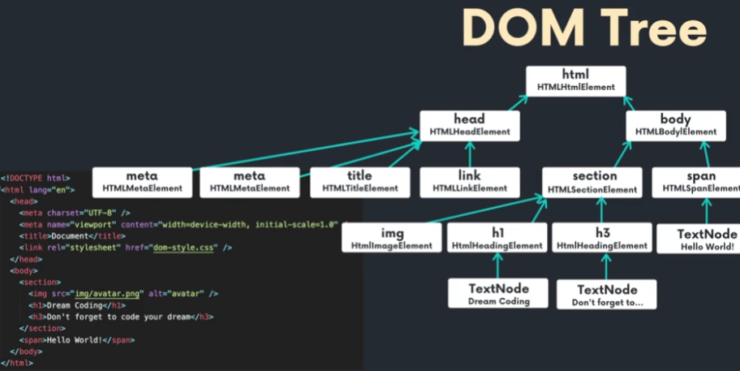

# DOM

> Document Object Model

브라우저가 웹페이지 즉 HTML파일을 읽어서 한 줄씩 읽으며 DOM트리로 변환하여 브라우저가 이해할 수 있도록 만들어나감
> DOM TREE

>참고자료
- DOM

https://developer.mozilla.org/en-US/docs/Web/API/Document_Object_Model/Introduction

- DOM API

https://developer.mozilla.org/en-US/docs/Web/API/HTML_DOM_API

※ const h2 = document.createElement('h2');
   h2.setAttribute('class','title') // <h2 class="title"></h2>

section.insertBefore(h2 , h3) = h3전에 h2를 넣음