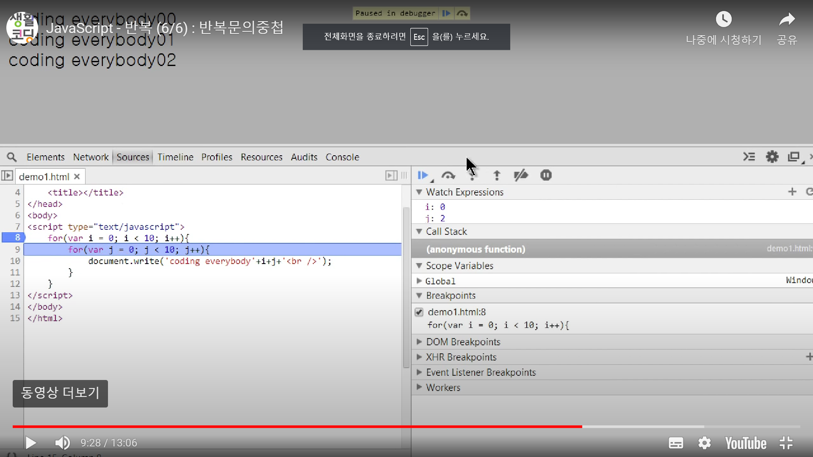

# 중첩 for문 에서의 debuger 사용법

1. sourse에서 원하는 파일 선택   
2. 왼쪽 파일에서의 파란색 표시로 debuger (브레이크 포인트) 표시    
* Watch Expressions에서 원하는 값을 따로 볼 수 있음
* 화살표 버튼으로 코드 실행
* 아래로 향하는 화살표로 코드를 하나씩 실행
* 파란색으로 표시되는 코드가 현재 실행되고 있는 코드를 뜻 함 
* 끌때는 파란색 표시 debuger포인트를 눌러 없애고 일시정지